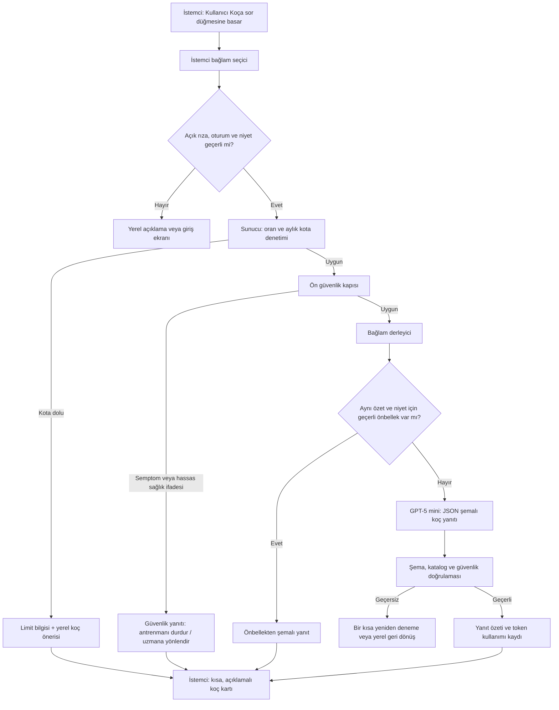

# IronPulse AI Koçu: Maliyet Optimizasyonu ve Talep-Üzerine Mimari

**Tarih:** 27 Ağustos 2026  
**Karar özeti:** IronPulse'un mevcut plan motoru, atlas eşlemesi, başarı sayacı ve günlük koç kartı yerel/kural tabanlı kalmalıdır. Yapay zekâ yalnızca kullanıcı açıkça **“Koça sor”**, **“Haftamı yorumla”** veya **“Planımı açıkla”** eylemlerinden birini seçtiğinde, kısa ve yapılandırılmış bir bağlamla çağrılmalıdır. Bu yaklaşım maliyeti, gecikmeyi ve sağlık güvenliği riskini sınırlarken kullanıcıya açıklamalı öneri değeri sunar.

> Bu tasarım, eğitim amaçlı fitness yönlendirmesi içindir. AI koç; teşhis, tedavi, sakatlık değerlendirmesi, kişiselleştirilmiş kalori/makro reçetesi veya garanti edilmiş fiziksel sonuç üretmemelidir. Keskin ağrı, baş dönmesi, göğüs ağrısı veya olağandışı semptom bildirimi kural tabanlı güvenlik yanıtına yönlendirilmelidir.

## 1. Maliyet yaklaşımı

Maliyet kontrolü, daha ucuz bir model seçmekten önce **gereksiz çağrıyı hiç yapmamakla** başlar. Bugün kartındaki kısa koç mesajı, antrenman serisi, plan üretimi ve temel ilerleme önerileri, zaten mevcut olan yerel verilere dayalıdır ve AI çağrısı gerektirmez. Sunucu çağrısı yalnızca kullanıcının talep ettiği açıklama veya yorum için yapılır.

Örnek maliyet tablosu, tek bir koç isteğinde **1.500 giriş tokenı ve 300 çıkış tokenı** varsayımıyla hesaplanmıştır. Bu, kısa profil özeti, son antrenman özetleri ve 3–5 maddelik Türkçe yanıt için üst sınır niteliğinde bir tasarım hedefidir; gerçek fatura kullanım ve sağlayıcı fiyat güncellemelerine göre değişir.

| Model | IronPulse'taki rol | Liste fiyatı (giriş / çıkış, USD / 1M token) | Örnek istek | 1.000 örnek istek | Karar |
|---|---|---:|---:|---:|---|
| **GPT-5 nano** | Niyet, uzunluk ve güvenlik yönlendirme sınıflaması | $0,05 / $0,40 | $0,000195 | $0,195 | Sadece yüksek hacimli basit sınıflama gerekiyorsa.
| **GPT-5 mini** | Varsayılan metin tabanlı AI koç; kısa plan yorumu ve açıklama | $0,25 / $2,00 | $0,000975 | $0,975 | **Önerilen varsayılan model.**
| **Claude Haiku 4.5** | Alternatif kısa diyalog veya sağlayıcı yedekliliği | $1 / $5 | $0,003000 | $3,000 | Kalite/ton denemesi veya yedek yol için.
| **Gemini 3 Flash Preview** | Uzun kayıt özeti ya da ileride isteğe bağlı çok modlu girdi | $0,50 / $3,00 | $0,001650 | $1,650 | Uzun bağlam ya da görsel ihtiyaç doğarsa seçici kullanım.
| **GPT-5** | Açık kullanıcı talebiyle karmaşık, daha derin plan gözden geçirme | $1,25 / $10,00 | $0,004875 | $4,875 | Varsayılan olmamalı; kontrollü yükseltme yolu.

GPT-5 mini'nin resmî listelenen fiyatı girişte $0,25, çıkışta $2,00 / 1M token seviyesindedir.[1] Claude Haiku 4.5 için Anthropic $1 / $5, Gemini'nin güncel Flash ailesi için Google 1M token bazlı giriş/çıkış fiyatı ve batch indirimi yayımlar.[2] [3] Proje içindeki canlı model kataloğu, çağrı anında model kimliği ile fiyat uygunluğunun tekrar doğrulanması için kaynak kabul edilmelidir; sabit model listesi kod içine gömülmemelidir.

### Önerilen maliyet tavanı

| Katman | Kullanıcı görünürlüğü | Limit | Maksimum yanıt | Amaç |
|---|---|---:|---:|---|
| Yerel koç | Her zaman açık | AI çağrısı yok | Yerel metin | Günlük amaç, seri, sonraki küçük adım.
| Başlangıç AI koçu | Kullanıcı düğmeye basar | 3 istek/gün, 20 istek/ay | 300 token | Yeni kullanıcıda değer doğrulama ve maliyet sınırı.
| Aktif kullanıcı | Kullanıcı düğmeye basar | 6 istek/gün, 60 istek/ay | 400 token | Düzenli yorum ve plan açıklaması.
| Derin plan incelemesi | İkinci onayla kullanıcı başlatır | 2 istek/ay | 650 token | GPT-5 veya eşdeğeri ile 4–12 haftalık plan değerlendirmesi.
| Küresel koruma | Sunucu tarafı | Proje günlük bütçe eşiği | Çağrı engellenir | Beklenmeyen trafik veya kötüye kullanımı sınırlama.

Örneğin başlangıç katmanında kullanıcı başına aylık 20 GPT-5 mini isteği ve yukarıdaki token bütçesi, yaklaşık **$0,0195** model kullanımı hedefler; güvenlik kontrolü, tekrar denemeleri ve beklenmedik uzunluklar için ürün bütçesinde kullanıcı başına **$0,03/ay** koruma marjı ayrılabilir. Bu yalnızca tasarım varsayımıdır; kesin harcama taahhüdü değildir.

## 2. Maliyet/performans model tercihi

IronPulse, salt metin tabanlı kısa antrenman yorumunda önce **GPT-5 mini** ile başlamalıdır. Model maliyeti düşük, yanıtı kısa JSON şemasıyla sınırlanabilir ve kullanım senaryosu; genel bilgilerle desteklenmiş, mevcut uygulama verisini açıklayan bir koç yanıtıdır. Daha zayıf bir modeli doğrudan kullanıcıya açık koç yanıtı üretmekte kullanmak yerine, basit niyet sınıflaması mümkünse tamamen kural tabanlı yapılmalıdır. Örneğin “planımı açıkla”, “bugün ne yapayım?” ve “son antrenmanımı yorumla” niyetleri istemci ya da sunucuda sabit seçeneklerle belirlenebilir.

| Senaryo | İlk tercih | Ne zaman yükseltilir? | Neden |
|---|---|---|---|
| Son antrenman yorumlama | GPT-5 mini | Yanıt şema doğrulamasını iki kez geçemezse | Kısa, bağlama duyarlı Türkçe açıklama için iyi denge.
| Planın nedenini açıklama | GPT-5 mini | Yükseltme gerekmez | Mevcut plan motoru zaten kararın veri kaynağıdır.
| 4–12 haftalık plan incelemesi | GPT-5 mini, isteğe bağlı GPT-5 yükseltmesi | Kullanıcı “ayrıntılı inceleme”yi ayrıca onaylarsa | Pahalı muhakeme çağrısı herkese uygulanmaz.
| Serbest metin risk etiketi | Kural tabanlı anahtar kelime + gerekirse GPT-5 nano | Belirsiz sınıflama varsa | Ağrı/semptom ifadeleri ana koç üretimine ulaşmadan kapatılır.
| İleride form görseli/uzun günlük özeti | Gemini 3 Flash Preview | Çok modlu girdi gerçekten gerekirse | Uzun veya çok modlu bağlam için ayrı, isteğe bağlı yol.
| Sağlık semptomu, sakatlık, ilaç, yeme bozukluğu | AI modeli yok | Yok | Güvenlik yanıtı ve profesyonel yönlendirme kullanılır.

Üçüncü taraf web araması, araç çağrısı, otomatik “derin araştırma” veya her antrenman bittiğinde AI analizi başlangıç sürümünde kullanılmamalıdır. Arama ve araçlar ilave maliyet, denetlenmesi güç kaynak riski ve daha uzun gecikme yaratır. Uygulamadaki doğrulanmış egzersiz rehberi, video matrisi, form kontrol listesi ve hazır plan kuralları bu amaçla birincil kaynak kalır.

## 3. Talep-üzerine AI koç mimarisi



Mimari, model anahtarını hiçbir zaman Expo istemcisine koymaz. İstemci yalnızca kullanıcı tarafından seçilen niyeti ve minimum, anonimleştirilmiş veri özetini sunucuya iletir. Sunucu, kimlik doğrulama, rate-limit, bütçe, model çağrısı, şema doğrulaması ve denetim kaydının tek sahibidir. Model çağrısı sunucu tarafında gerçekleştirilmelidir; istemci anahtarları veya model sağlayıcı uç noktalarını doğrudan çağıramaz.

| Bileşen | Sorumluluk | Maliyet ve güvenlik kuralı |
|---|---|---|
| İstemci bağlam seçici | Son 7 günün özetini, aktif hedefi ve kullanıcının seçtiği niyeti oluşturur. | Tüm geçmişi, serbest sohbeti veya hassas ölçümleri varsayılan olarak göndermez.
| Sunucu kota koruyucusu | Kullanıcı/gün, kullanıcı/ay ve proje bütçesi sayaçlarını kontrol eder. | İdempotency anahtarı ile çift dokunuşu tek çağrı yapar.
| Güvenlik kapısı | Ağrı, yaralanma, ilaç, gebelik, yeme bozukluğu ve semptom ifadelerini ayıklar. | Riskli durumda LLM'e geçmez; hazır güvenlik kartı döner.
| Bağlam derleyici | Sayısal ham kayıt yerine kısa özet üretir. | En fazla 1.500 giriş tokenı; yalnızca tamamlanmış setler ve son 7–14 gün.
| Önbellek | `kullanıcı + niyet + veri-özet-hash` anahtarıyla yanıtı saklar. | Aynı veri için 12 saat, plan açıklaması için plan değişene kadar geçerli.
| Model yönlendirici | Varsayılan GPT-5 mini; istisnai kullanıcı onayıyla üst model. | Varsayılan akışta düşünme bütçesi kapalı/düşük ve 300–400 output token tavanı.
| Çıktı doğrulayıcı | JSON şeması, hareket kimlikleri, ton ve sağlık kısıtlarını doğrular. | Katalog dışı hareketi, mutlak sağlık iddiasını ve keskin kalori hedeflerini reddeder.

## 4. İstek sözleşmesi ve JSON çıktısı

İstem gönderimi serbest sohbet geçmişi yerine seçili niyet, kısa kullanıcı sorusu ve deterministik veri özeti taşımalıdır. Her çağrıda modele açıkça “yalnızca JSON üret” denmeli; sunucu `additionalProperties: false` olan katı bir JSON şeması ile çıktıyı doğrulamalıdır. Mevcut platform proxy'si yapılandırılmış JSON çıktısını destekler; model çağrısı canlı katalogdan seçilen kimlikle sunucu tarafında yapılmalıdır.[4]

```json
{
  "intent": "workout_review",
  "goal": "Kas kazanımı",
  "experience": "Başlangıç",
  "week_summary": {
    "completed_sessions": 2,
    "planned_sessions": 3,
    "completed_sets": 14,
    "form_compliance_percent": 78,
    "sleep_hours_recent": 6.5
  },
  "question": "Bu haftanın son antrenmanında neye odaklanmalıyım?"
}
```

```json
{
  "headline": "Son oturum için teknik ve toparlanma önceliği",
  "reasoning": "... gerçek kayda dayalı kısa açıklama ...",
  "actions": [
    { "title": "Goblet squat yükünü koru", "detail": "...", "source_metric": "RPE 9" }
  ],
  "safety_note": "Keskin ağrı veya olağandışı semptomda hareketi durdur.",
  "follow_up": "Antrenman sonrasında setlerini kaydet."
}
```

## 5. Uygulanabilir limit ve önbellek kuralları

| Kural | Önerilen değer | Gerekçe |
|---|---:|---|
| Giriş bağlamı | Son 7 gün; en fazla 1.500 token | Uzun geçmiş yerine karar için gereken güncel veriyi taşır.
| Yanıt uzunluğu | En fazla 300 token; derin incelemede 650 | Koç kartını eyleme dönük ve maliyeti öngörülebilir tutar.
| Aynı isteğin önbelleği | 12 saat | Veri değişmemişse aynı yorumu yeniden üretmez.
| Plan açıklama önbelleği | Plan/değişken değişene kadar | Statik plan mantığını tekrar çağırmaz.
| Yeniden deneme | En fazla 1 | Hatalı şema için bir telafi sağlar; döngüsel maliyeti önler.
| Şema geçmezse | Yerel geri dönüş | Kullanıcı boş ekran görmez; ikinci pahalı yükseltme yapılmaz.
| Üst model yükseltmesi | Yalnızca açık kullanıcı onayı | Derinlik ihtiyacını görünür maliyet ve beklentiyle ilişkilendirir.

Bu stratejide AI koçu ürünün tek karar vericisi değildir. Plan motoru, egzersiz kataloğu, video doğrulama matrisi ve güvenlik uyarıları deterministik kalır; model bunların üstünde yalnızca **“ne gördüm, neden önemli ve bugün ne yapabilirsin?”** açıklamasını üretir. Böylece yanlış hareket ekleme veya doğrulanmamış sağlık iddiası üretme riski azaltılır.

## 6. İlk sürüm için önerilen karar

İlk canlı AI koç sürümü için **GPT-5 mini + 3 istek/gün + 20 istek/ay + 12 saat önbellek + 300 output token** paketi önerilir. Model, yalnızca dört sabit niyette çalışır: `workout_review`, `today_focus`, `plan_explanation` ve `weekly_reflection`. Serbest form sohbet, görsel analiz, web araması ve otomatik arka plan analizi kapalı tutulur. Her yanıt, gerçek set/antrenman verisine dayandığını görünür biçimde açıklar; verinin yetersiz olduğu durumda “daha fazla kayıt gerekli” yanıtını döner.

## References

[1] [OpenAI — GPT-5 mini model and API pricing](https://developers.openai.com/api/docs/models/gpt-5-mini)  
[2] [Anthropic — Claude Platform pricing](https://platform.claude.com/docs/en/about-claude/pricing)  
[3] [Google AI for Developers — Gemini API pricing](https://ai.google.dev/gemini-api/docs/pricing)  
[4] [Manus built-in LLM model integration guidance](https://help.manus.im)
